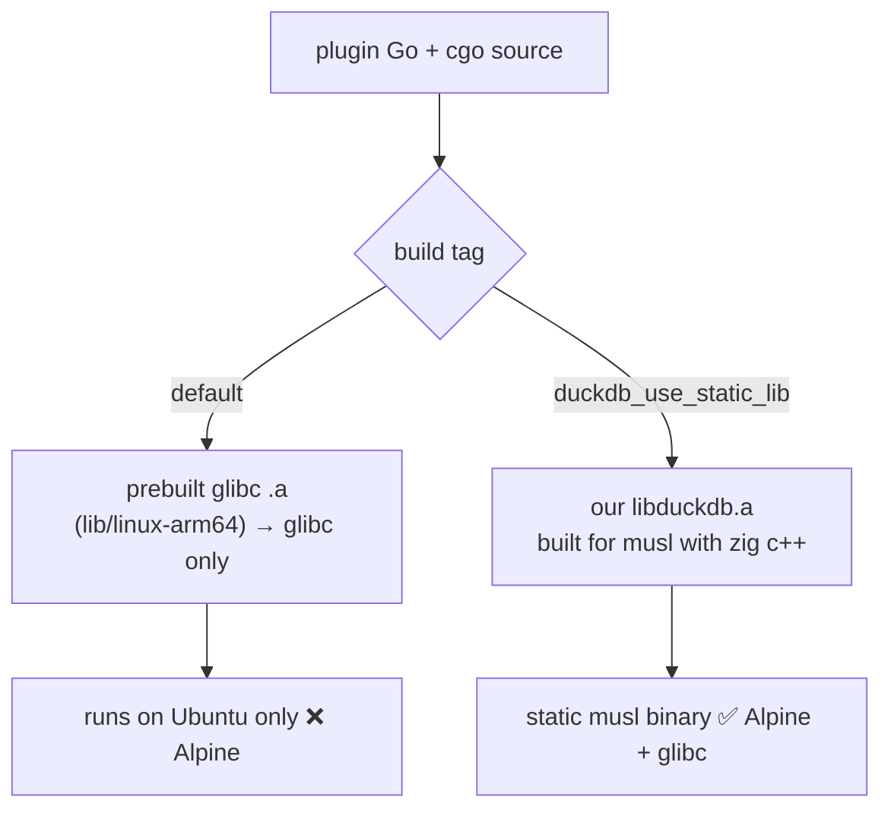

# Zig cross-compile: blog reproduction → musl DuckDB plugin

> **Goal:** reproduce Andrew Kelley's [`zig cc` blog post](https://andrewkelley.me/post/zig-cc-powerful-drop-in-replacement-gcc-clang.html)
> on macOS, then climb a validation ladder to the real prize — a **musl/Alpine-compatible**
> build of the [Grafana DuckDB datasource plugin](https://github.com/motherduckdb/grafana-duckdb-datasource),
> fixing [issue #80](https://github.com/motherduckdb/grafana-duckdb-datasource/issues/80).
> Verified via Docker locally and (later) on a K8s dev cluster.

## Progress

- [x] **Stage 0** — Tooling installed (zig 0.16.0, jq); Docker binfmt/Rosetta confirmed (amd64 emulation runs).
- [x] **Stage 1** — `hello.c` built for aarch64-musl / x86_64-musl / x86_64-gnu (committed).
- [x] **Stage 2** — tiny C++ ran on Alpine (arm64 + amd64); exception thrown/caught ✓ (the C++ runtime de-risk).
- [x] **Stage 3** — tiny Go + cgo ran static on Alpine arm64 ✓ (full Go+cgo+zig+musl path proven; last rung before DuckDB).
- [x] **Stage 4** — `libduckdb.a` for **aarch64-musl** built (461 MB, DuckDB v1.5.4); plus the finding that zig folds `-O1/-O2/-O3` into one `-O2`-equivalent. (x86_64-musl not built — identical recipe.)
- [x] **Stage 5** — plugin backend linked against the musl `libduckdb.a` ✓ — **331 MB fully static** aarch64 ELF (no `NEEDED` libs, no loader), built first try with `-lc++ -lc++abi`.
- [x] **Stage 6** — ran on Alpine (arm64) ✓✓: plugin SDK initializes, and a standalone `SELECT 21*2` returns **42** — DuckDB executes queries on musl. **#80 proven solved.**
- [x] **Stage 7** — opened PR [#94](https://github.com/motherduckdb/grafana-duckdb-datasource/pull/94) adding Zig/musl builds to the plugin CI/release flow; **green on the fork for amd64 + arm64** (build + Alpine smoke test). PR #94 and issue #80 were later closed because fully static musl cannot load runtime DuckDB extensions and DuckDB documents musl as a poor-performance environment.
- [ ] **Stage 8** — bake the `httpfs` DuckDB extension into a musl/Alpine build that runs in the stock `grafana/grafana` image, so Alpine can read `https://`/S3-style inputs without relying on dynamic extension loading.

## Environment (this machine)

- Host: macOS, Apple **M3 Pro (arm64)**.
- Toolchain: zig **0.16.0**, Go 1.26, Docker 29, Homebrew.
- Scratch work happens in this repo (`zig-cc-lab/`). The plugin is a **separate clone** of
  `motherduckdb/grafana-duckdb-datasource`.
- **Layout:** each stage lives in its own folder (`stage1-c/`, `stage2-cpp/`, `stage3-cgo/`, `stage4-duckdb/`) so cgo never picks up a sibling stage's `.c`/`.cpp` (which would collide on `main` — see Stage 3). Run each stage's commands from the repo root.
- **Where Stage 8 lives:** keep the plan/results in this repo. The work spans the DuckDB checkout
  (`duckdb/duckdb`) and the plugin checkout, but this lab is the narrative + reproducibility record.

## My honest take (read first)

- **You do NOT need host QEMU.** The blog runs foreign binaries with user-mode QEMU (`qemu-aarch64 ./hello`), which only exists on a Linux host. On macOS, `brew install qemu` gives full-machine `qemu-system-*`, not what the blog uses. The practical equivalent is **Docker** (its Linux VM bundles `binfmt`+qemu-user, and can use Rosetta for fast x86_64). K8s dev clusters are the "real hardware" option.
- **Cross-compiling core Grafana with Zig is anticlimactic.** Grafana's backend already uses pure-Go SQLite (`modernc.org/sqlite`), so it cross-compiles with plain `GOOS/GOARCH` + `CGO_ENABLED=0` and Zig adds nothing. Adding a real CGo dep is what makes this a meaningful test.
- **The DuckDB plugin is the right testbed, and #80 is the real prize** — but "simpler first attempt" is partly a trap. The easy item from issue #80 (`-static-libstdc++ -static-libgcc`) does NOT make it run on Alpine; it only reduces glibc-side `libstdc++` errors. True musl support requires **building `libduckdb` from source against musl**. Good news: the bindings already expose `duckdb_use_static_lib` (and `duckdb_use_lib`), so we can supply a musl `libduckdb` WITHOUT forking the bindings.
- **Don't extend core Grafana with DuckDB** — strictly worse than using the standalone plugin (same CGo test, but messy and unmergeable). Skip it.

## Architecture of the problem



## Stage 0 — Tooling

```bash
brew install zig jq            # installs current zig (we're on 0.16.0)
zig version
# NOTE: zig 0.16's `zig targets` prints ZON, not JSON — piping to `jq` fails
# ("Invalid numeric literal" on the leading `.`). List libc targets with sed:
zig targets | sed -n '/\.libc = /,/},/p'   # confirm aarch64/x86_64 linux-musl + linux-gnu present
# one-time: enable cross-arch execution inside Docker (qemu-user + Rosetta)
docker run --privileged --rm tonistiigi/binfmt --install all
```
(Optional, only for the blog's Windows demo: `brew install --cask wine-stable`.)

## Stage 1 — Reproduce the blog: `hello.c` (answers "do we need QEMU?")

Cross-compile to 3 targets, then run each via Docker (not host qemu):

```bash
# run from the repo root
mkdir -p stage1-c && cd stage1-c
cat > hello.c <<'EOF'        # quoted-heredoc: shell/printf won't eat the %s
#include <stdio.h>
int main(void) { printf("hello from %s\n", "a zig-cross-compiled binary"); return 0; }
EOF
zig cc -o hello.aarch64-musl  hello.c -target aarch64-linux-musl
zig cc -o hello.x86_64-musl   hello.c -target x86_64-linux-musl
zig cc -o hello.x86_64-gnu    hello.c -target x86_64-linux-gnu
file hello.*                                  # confirm arch + static/dynamic
docker run --rm --platform linux/arm64 -v "$PWD:/w" -w /w alpine  ./hello.aarch64-musl  # native, fast
docker run --rm --platform linux/amd64 -v "$PWD:/w" -w /w alpine  ./hello.x86_64-musl   # Rosetta/qemu
docker run --rm --platform linux/amd64 -v "$PWD:/w" -w /w debian  ./hello.x86_64-gnu    # glibc
```

What `file` should show: musl targets are **statically linked** (portable, run anywhere incl. Alpine); the gnu target is **dynamically linked** with interpreter `/lib64/ld-linux-x86-64.so.2` (needs glibc → fails on Alpine). That contrast *is* issue #80 in miniature.

## Stage 2 — Tiny C++ program with `zig c++` (de-risks the C++ runtime)

Higher-signal than the blog's LuaJIT step: this directly probes static-musl C++ — `iostream`, `std::string`, and **exception unwinding** (libc++ / libc++abi), the exact runtime wrinkle that can bite in Stages 4–5.

```bash
# run from the repo root
mkdir -p stage2-cpp && cd stage2-cpp
cat > hellocpp.cpp <<'EOF'
#include <iostream>
#include <string>
#include <stdexcept>
int main() {
  try { throw std::runtime_error("exceptions work"); }
  catch (const std::exception& e) { std::cout << "hello from C++ (musl): " << e.what() << "\n"; }
  return 0;
}
EOF
zig c++ -Wno-nullability-completeness -o hellocpp.aarch64-musl hellocpp.cpp -target aarch64-linux-musl
zig c++ -Wno-nullability-completeness -o hellocpp.x86_64-musl  hellocpp.cpp -target x86_64-linux-musl
file hellocpp.*                                            # expect: statically linked
docker run --rm --platform linux/arm64 -v "$PWD:/w" -w /w alpine ./hellocpp.aarch64-musl
docker run --rm --platform linux/amd64 -v "$PWD:/w" -w /w alpine ./hellocpp.x86_64-musl
```
If both print the line (i.e. the exception was thrown and caught), static C++ on musl works and DuckDB's C++ is very likely to link and run.

> `-Wno-nullability-completeness` silences ~119 harmless warnings from Zig 0.16's bundled libc++ headers (an Apple/Clang nullability check) — they're not from our code. For the much noisier DuckDB build (Stage 4) we'll likely use `-w` to mute warnings entirely.

## Stage 3 — Tiny CGo Go program with Zig (de-risks DuckDB)

Minimal `import "C"` program, cross-compiled with Zig as the C compiler, run on Alpine.

> **Gotcha:** a cgo package automatically compiles every `.c`/`.cpp` file in **its own directory**. Our `hello.c` and `hellocpp.cpp` from Stages 1–2 each define `main()`, so building the Go program in the repo root collides (`ld.lld: error: duplicate symbol: main`). Fix: put the Go program in its own subdir (`stage3-cgo/`) so it has no stray C/C++ siblings. (If you skipped here: `package .: no Go files in ...` means there's no `.go` file in the build dir.)

```bash
mkdir -p stage3-cgo
cat > stage3-cgo/main.go <<'EOF'
package main

/*
#include <stdlib.h>
#include <stdio.h>
static void greet(const char* who) { printf("hello from Go+cgo (musl): %s\n", who); }
*/
import "C"
import "unsafe"

func main() {
	s := C.CString("cgo works")
	defer C.free(unsafe.Pointer(s))
	C.greet(s)
}
EOF
cd stage3-cgo && go mod init cgohello

CGO_ENABLED=1 GOOS=linux GOARCH=arm64 \
  CC="zig cc -target aarch64-linux-musl" CXX="zig c++ -target aarch64-linux-musl" \
  go build -ldflags '-linkmode external -extldflags "-static"' -o cgohello .
file cgohello                                                   # expect: ARM aarch64, statically linked
docker run --rm --platform linux/arm64 -v "$PWD:/w" -w /w alpine ./cgohello
```
This proves Go + cgo + zig + musl end-to-end before the big DuckDB build.

## Stage 4 — Build `libduckdb` for musl (the hard, uncertain step)

> Work in a dedicated subdir (e.g. `stage4-duckdb/`) so `duckdb.cpp` never sits in a Go package directory — same cgo "duplicate symbol: main" rule as Stage 3.

**1. Pin the version + download the amalgamation.** The plugin's `duckdb-go/v2 v2.10504.0` → bindings `v0.10504.0` → **DuckDB v1.5.4** (scheme: `v0.105XX.0` = `v1.5.XX`; confirmed by `#define DUCKDB_VERSION "v1.5.4"` in `duckdb.hpp`).

```bash
mkdir -p stage4-duckdb && cd stage4-duckdb
curl -fL -o libduckdb-src.zip https://github.com/duckdb/duckdb/releases/download/v1.5.4/libduckdb-src.zip
unzip -o -q libduckdb-src.zip && rm -f libduckdb-src.zip   # → duckdb.cpp (25 MB), duckdb.hpp, duckdb.h, duckdb_extension.h
```

**2. Compile the 25 MB single-TU amalgamation with `zig c++`** (slow, RAM-heavy — single-threaded, several minutes). **One build is all you need**: under `zig c++`, `-O1`/`-O2`/`-O3` all produce the same `-O2`-equivalent object (see the Finding below), so there's no point in per-level variants or cache isolation — just build once.

```bash
# from stage4-duckdb/  (run once; -O1 == -O2 == -O3 under zig, so just use -O2)
mkdir -p libduckdb-aarch64-musl
time zig c++ -target aarch64-linux-musl -std=c++11 -O2 -DNDEBUG -fPIC -w -c duckdb.cpp -o libduckdb-aarch64-musl/duckdb.o
zig ar rcs libduckdb-aarch64-musl/libduckdb.a libduckdb-aarch64-musl/duckdb.o
ls -lh libduckdb-aarch64-musl/
```

The experiment that revealed the collapse (each a genuine compile on M3 Pro / 18 GB, `aarch64-linux-musl`, single-threaded):

| level | wall time | `libduckdb.a` | object                  |
| ----- | --------- | ------------- | ----------------------- |
| `-O1` | 7m22s     | 461 MB        | baseline                |
| `-O2` | 4m23s     | 461 MB        | byte-identical to `-O1` |
| `-O3` | 4m28s     | 461 MB        | byte-identical to `-O1` |

> **Finding (confirmed with runtime evidence):** `zig cc`/`zig c++` collapses `-O1`/`-O2`/`-O3` (and `-Ofast`) into ONE optimization mode — all emit byte-identical objects (478,459,816 B; `cmp`-identical), despite each being a genuine ~4–7 min compile. Verified on a small program (`opt-test/probe-opt.sh`): zig gives `-O1`=`-O2`=`-O3` while `-O0`/`-Os` differ, whereas real `clang` produces a *distinct* `-O1`. DuckDB does NOT pin `-O3` (only 2 localized `__attribute__((optimize))`). So under zig there's effectively a single optimized build — pick any level; building three is redundant. **Mechanism** (verified against the Zig 0.16.0 source tarball): `src/main.zig:2231` ORs `-O1/-O2/-O3/-O4/-Ofast` into one `optimize_mode = .ReleaseFast`, then `src/Compilation.zig:6658` (`.ReleaseFast =>`) appends clang `-cc1 -O2` — with a code comment that `-O3` is "tested less / less safe" for C. GitHub permalinks (master @ `738d2be`, identical code): [main.zig#L2161-L2174](https://github.com/ziglang/zig/blob/738d2be9d6b6ef3ff3559130c05159ef53336224/src/main.zig#L2161-L2174), [Compilation.zig#L7054-L7060](https://github.com/ziglang/zig/blob/738d2be9d6b6ef3ff3559130c05159ef53336224/src/Compilation.zig#L7054-L7060). So what you actually have is a **`-O2`-equivalent** DuckDB. Note: no clean `-O3`-release path found — `-Xclang -O3` on `zig cc -c` is a no-op (cc1 gets both `-O2` and `-O3`; the earlier `-O2` wins), and `zig build-obj -cflags -O3` *does* reach clang but only in Debug mode (drags in `-fsanitize=undefined`, frame pointers), while `-OReleaseFast` re-collapses to `-O2`. A genuine `-O3` release would need real clang + a musl sysroot. Likely not worth it — `-O2` is fine/recommended for this much C++.
>
> Memory note: `-O1` peaked ~2.6 GB+ resident; each real build is single-threaded (~one core).

> **Why staying on `-O2` is justified — the `-O2`→`-O3` perf delta is small.** For whole-application/DB workloads it's low single digits, not worth fragmenting the toolchain (libc++ vs libstdc++) to chase:
> - **PostgreSQL** (real DBMS, pgbench — [Eisentraut 2024](http://peter.eisentraut.org/blog/2024/06/25/postgresql-performance-with-different-compilers)): `-O3` vs `-O2` ≈ **~1%** (and `-Os` was ~10% *slower*).
> - **clang microbenchmarks** ([markaicode 2025](https://markaicode.com/vs/gcc-14-vs-clang-18/)): ~**2–4%** on string/memory work, up to **~14–18%** only on pure FP/SIMD kernels.
> - `-O3` can even **regress** on big codebases (aggressive unrolling → code bloat → L1 i-cache misses — [Stan forum](https://discourse.mc-stan.org/t/o2-vs-o3-compiler-optimization-level/3714)).
> - LLVM/clang's `-O2`↔`-O3` gap is **smaller than GCC's** ([SUSE GCC 11 docs](https://documentation.suse.com/sbp/devel-tools/pdf/SBP-GCC-11_en.pdf)), and clang `-O2` already auto-vectorizes — and zig *is* clang.
> - **DuckDB estimate:** low single digits (likely ~1–5%, plausibly nearer PostgreSQL's ~1%); its speed is dominated by its vectorized execution engine/algorithms, not compiler auto-vec of scalar loops. Only a benchmark on representative queries would pin the exact number.
> - **Decision: stay on `-O2`.** (Zig also argues `-O2` is the safer/better-tested path for C/C++.)

- Shortcut to check first: see if anyone already publishes a musl `.a` (upstream issue `duckdb/duckdb-go-bindings#72`).

## Stage 5 — Build the plugin against the musl `libduckdb`

In the **plugin repo clone** (`grafana-duckdb-datasource`), bypass Mage for the experiment and build the backend (`./pkg`) directly with the static-lib tag. Point `LIBDIR` at the `.a` produced in Stage 4:

```bash
LIBDIR=/path/to/zig-cc-lab/stage4-duckdb/libduckdb-aarch64-musl   # dir holding the libduckdb.a from Stage 4
CGO_ENABLED=1 GOOS=linux GOARCH=arm64 \
  CC="zig cc -target aarch64-linux-musl" CXX="zig c++ -target aarch64-linux-musl" \
  CGO_LDFLAGS="-L$LIBDIR -lduckdb -lc++ -lc++abi -lm" \
  go build -tags duckdb_use_static_lib -ldflags '-linkmode external -extldflags "-static"' \
  -o dist/gpx_duckdb_datasource_linux_arm64 ./pkg
file dist/gpx_*
```
**Result — worked first try (~29s).** `dist/gpx_duckdb_datasource_linux_arm64` is a **331 MB fully static aarch64 ELF**; `llvm-readelf -d` shows **no `NEEDED` libs and no `PT_INTERP`**. The feared libc++-vs-libstdc++ wrinkle never materialized — `-lc++ -lc++abi` (zig's bundled libc++) linked cleanly. `-I${SRCDIR}/include` from the `duckdb_use_static_lib` tag supplied `duckdb.h`.

## Stage 6 — Run on Alpine (prove #80 is fixed)

- Local Docker (Alpine image, arm64):

```bash
docker run --rm -p 3000:3000 --platform linux/arm64 \
  -v "$PWD/dist:/var/lib/grafana/plugins/motherduck-duckdb-datasource" \
  -e GF_PLUGINS_ALLOW_LOADING_UNSIGNED_PLUGINS=motherduck-duckdb-datasource \
  grafana/grafana:latest        # NOTE: default (Alpine), not -ubuntu
```
Add the DuckDB datasource, run `SELECT 42;` and a `read_csv_auto(...)` to confirm extensions load and it doesn't hit the musl/`libstdc++` errors documented in the README.
- K8s dev cluster: deploy a Grafana (Alpine) pod with the plugin — best place to validate the **amd64** build on real hardware.

**Result — #80 proven solved (verified locally on Alpine arm64):**
- The static-musl plugin binary runs on Alpine (`docker run --platform linux/arm64 alpine ./gpx_..._linux_arm64`): the Grafana plugin SDK initializes (`"Serving plugin"`, capabilities `resource/data/stream/diagnostics`) with **no glibc loader error and no `libstdc++.so.6` failure** — exactly the symptoms #80 documents.
- A minimal standalone program (`stage6-duckdb-run/`, built with the identical musl toolchain) runs a real query on Alpine: **`SELECT 21*2 = 42`** → the DuckDB engine executes SQL on musl.
- Remaining stretch (not done): the full Grafana-on-Alpine *UI* run (build the frontend, assemble the plugin dist, provision a datasource, query through the UI/API). The binary-level proofs above already establish musl compatibility; the UI run is packaging, not a new risk.

## Stage 7 — Productionize + PR for #80

Goal: turn the local proof into a downstream plugin CI workflow that produces static-musl backend binaries.

**Result:** PR [motherduckdb/grafana-duckdb-datasource#94](https://github.com/motherduckdb/grafana-duckdb-datasource/pull/94) modified `.github/workflows/ci.yml` and `README.md` so Linux release artifacts would use static musl backend binaries. It cross-compiled amd64 + arm64 with Zig, smoke-tested both on Alpine, and was green on the fork. PR #94 and issue #80 were later closed because the fully static musl path cannot load runtime DuckDB extensions (`dlopen` is unavailable), and because DuckDB documents musl as materially slower than glibc.

The unresolved design question was not "can the plugin run on Alpine?" — that was proven in Stage 6/7. For PR #94 to make sense for the MotherDuck datasource specifically, the real target would be baking in the `motherduck` extension. That is probably not testable here because the extension is closed source and would need vendor cooperation. Stage 8 uses `httpfs` instead: it is an OSS extension that proves whether the static-bundling technique can preserve remote-file behavior for a vanilla DuckDB datasource.

## Stage 8 — Bake `httpfs` into static-musl DuckDB

Stage 4 used the released single-file amalgamation and compiled only `duckdb.cpp`. That produces a working static musl engine, but it does not include the out-of-tree `httpfs` extension or DuckDB's generated static extension loader. In the amalgamation source, extension macros such as `DUCKDB_EXTENSION_HTTPFS_LINKED` default to false unless the build wires in the extension code.

**My read:** this should be a DuckDB **CMake extension build** experiment, not another plain `zig c++ duckdb.cpp` experiment.

DuckDB already has the relevant machinery:

- `duckdb/duckdb/.github/config/extensions/httpfs.cmake` registers `httpfs` via `duckdb_extension_load(httpfs ...)`.
- Because that config does not use `DONT_LINK`, the normal CMake path should statically link `httpfs`.
- `extension/CMakeLists.txt` generates the static loader that calls `LoadStaticExtension<HttpfsExtension>()`.
- `httpfs` pulls transitive native deps (`curl`, `openssl`, plus DuckDB's bundled crypto pieces), so collecting/linking the complete static closure is the hard part.

**Does this need a DuckDB branch?** Not for the first attempt. Start with upstream DuckDB build flags/config. Only branch DuckDB if the `v1.5.4` source needs a patch for musl/vcpkg/static dependency collection. If that happens, use a local branch such as `sj/httpfs-musl-v1.5.4` and keep the patch narrow.

**Version pin:** keep DuckDB at **v1.5.4** for this experiment because the Go verifier and plugin currently use `github.com/duckdb/duckdb-go/v2 v2.10504.0` / `duckdb-go-bindings v0.10504.0`. Building DuckDB `main` would muddy ABI/version compatibility.

Proposed flow:

```bash
# In a clean DuckDB v1.5.4 checkout/worktree, first prove the mechanism on the host.
make setup-vcpkg
export VCPKG_TOOLCHAIN_PATH="$PWD/vcpkg/scripts/buildsystems/vcpkg.cmake"

EXTENSION_CONFIGS='.github/config/bundled_extensions.cmake;.github/config/extensions/httpfs.cmake' \
  USE_MERGED_VCPKG_MANIFEST=1 \
  BUILD_HTTPFS=1 \
  STATIC_OPENSSL=1 \
  ENABLE_JEMALLOC=0 \
  make extension_configuration

EXTENSION_CONFIGS='.github/config/bundled_extensions.cmake;.github/config/extensions/httpfs.cmake' \
  USE_MERGED_VCPKG_MANIFEST=1 \
  BUILD_HTTPFS=1 \
  STATIC_OPENSSL=1 \
  ENABLE_JEMALLOC=0 \
  make release
```

Then move to the musl/Alpine artifact. The clarified target is not "every transitive dependency is static"; it is "runs inside the default `grafana/grafana` Alpine image without `apk add`." That image already provides musl, `libcurl`, OpenSSL, zlib, and curl's shared transitive dependencies, but not the C++ runtime libraries that DuckDB normally needs.

```bash
# First target: dynamically use Alpine/Grafana-provided curl/OpenSSL/zlib,
# but statically link the C++ runtime so the artifact does not require
# libstdc++.so.6 or libgcc_s.so.1 in the Grafana image.
EXTENSION_CONFIGS='.github/config/bundled_extensions.cmake;.github/config/extensions/httpfs.cmake' \
  USE_MERGED_VCPKG_MANIFEST=1 \
  BUILD_HTTPFS=1 \
  ENABLE_JEMALLOC=0 \
  DISABLE_EXTENSION_LOAD=1 \
  CMAKE_EXE_LINKER_FLAGS='-static-libstdc++ -static-libgcc' \
  make release
```

Do the first smoke test against the DuckDB CLI because it isolates the native runtime question from Go/plugin packaging:

- `file`/`ldd` should show no dependency on `libstdc++.so.6` or `libgcc_s.so.1`;
- running the CLI inside `grafana/grafana` with `--entrypoint sh` should work without installing packages;
- `SELECT extension_name, loaded FROM duckdb_extensions() WHERE extension_name = 'httpfs';` should report `httpfs` available/loaded;
- an `https://` or local HTTP `read_csv(...)` query should succeed.

Only if the stock-image CLI smoke passes, move the same build shape into the Go/plugin proof. If the CLI still needs libraries missing from `grafana/grafana`, fix that native dependency shape before involving cgo.

The full-static fallback is deliberately lower priority now: `make bundle-library`/static curl closure is still useful if the Grafana image stops shipping the needed shared libraries, but it pulls in curl's entire static transitive dependency graph and is not required by the clarified default-image goal.

Verification should be a new isolated harness, e.g. `stage8-duckdb-httpfs/`, based on `stage6-duckdb-run/`:

- run `SELECT extension_name, loaded FROM duckdb_extensions() WHERE extension_name = 'httpfs';`
- start a tiny local HTTP server inside the Alpine/Docker test and query a CSV via `read_csv('http://127.0.0.1:.../sample.csv')`;
- link with `duckdb_use_static_lib`; if the Go verifier uses Grafana-provided shared curl/OpenSSL/zlib, do not force `-extldflags "-static"` for the entire binary, but do keep the C++ runtime static;
- record `file` / `llvm-readelf` output, binary size, and the SQL result here.

If Stage 8 works, it does **not** revive PR #94 by itself. Reviving PR #94 for the MotherDuck datasource would require the analogous thing with the closed-source `motherduck` extension baked in. What Stage 8 can prove is narrower and more interesting for a vanilla DuckDB datasource: "a static-musl DuckDB-backed plugin can keep `httpfs`/remote-file behavior by compiling the OSS extension in, despite dynamic DuckDB extensions being unavailable."

## Then extend the same technique to Grafana (optional)

Once the plugin works, do the trivial contrast: cross-compile Grafana's backend (`make build-backend` with `GOOS/GOARCH`, pure Go) to show it "just works", and note that the interesting CGo cross-compile story is the plugin, not core.

## Biggest risks (honest)

- Stage 8 is likely to fail first on dependency shape, not DuckDB registration: `httpfs` needs curl/OpenSSL/zlib, and the artifact must either use the shared libraries already present in the stock Grafana Alpine image or carry its own copies. The C++ runtime should not be assumed present.
- The Stage 4 single-amalgamation shortcut is proven for core DuckDB, but it is probably the wrong build primitive for out-of-tree extensions. Use DuckDB CMake first; only fall back to patching `package_build.py`/amalgamation generation if CMake cannot produce a usable artifact.
- Even if `httpfs` works, this does not remove the larger objection recorded when #94/#80 were closed: DuckDB recommends glibc over musl for performance, and static linking still cannot support arbitrary runtime extensions. For the MotherDuck datasource, the relevant extension is `motherduck`, not `httpfs`.
- Zig **0.16.0** is bleeding-edge; if a big C++ build hits `zig c++` regressions, fall back to a known-good stable (e.g. 0.14.x) from a tarball at ziglang.org/download.

## Follow-ups (not done in this session — left for you)

- **Stage 7 (PR for #80):** done as PR [#94](https://github.com/motherduckdb/grafana-duckdb-datasource/pull/94), which modified `.github/workflows/ci.yml` to cross-compile static musl binaries with `zig cc` (no QEMU for the build) and smoke-test them on Alpine. **CI was green on the fork for amd64 + arm64** (arm64 needed an added swap step for the memory-heavy aarch64 amalgamation compile; pinned Zig 0.16.0). PR #94 and issue #80 were later closed because dynamic DuckDB extensions cannot load from the fully static binary and musl is a poor performance fit for DuckDB; Stage 8 may be the reason to revisit a narrower vanilla-DuckDB datasource variant, not the MotherDuck datasource as-is.
- **x86_64-musl `libduckdb`:** not built — identical recipe (`-target x86_64-linux-musl`). Worth doing since Grafana Cloud nodes are likely amd64; run on Alpine amd64 via Rosetta/qemu or a real amd64 K8s node.
- **Full Grafana-on-Alpine UI run** + a `read_csv_auto(...)`/extension query (the Stage 6 stretch). The binary-level proof is done; this is packaging.
- **`-O3`** — only if a benchmark on real queries justifies it; that means native Alpine gcc, not zig (see the Stage 4 `-O2` justification).
