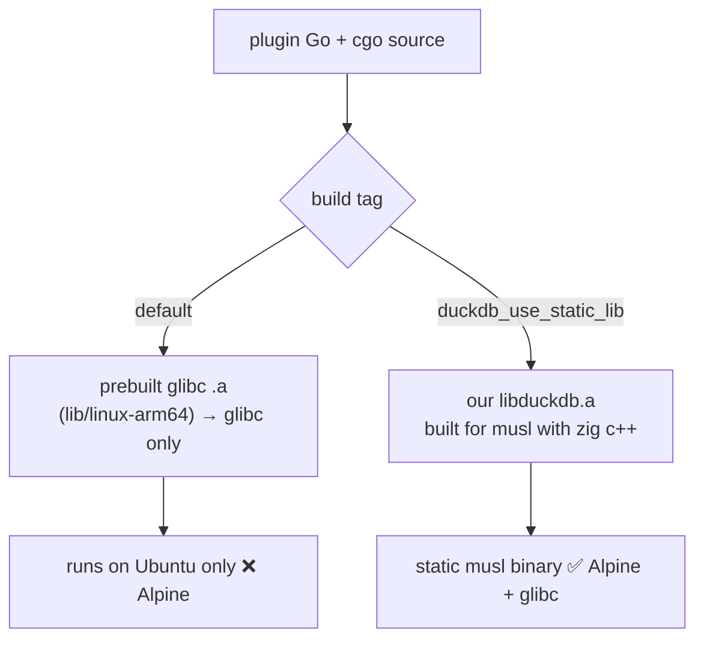

# Zig cross-compile: blog reproduction → musl DuckDB plugin

> **Goal:** reproduce Andrew Kelley's [`zig cc` blog post](https://andrewkelley.me/post/zig-cc-powerful-drop-in-replacement-gcc-clang.html)
> on macOS, then climb a validation ladder to the real prize — a **musl/Alpine-compatible**
> build of the [Grafana DuckDB datasource plugin](https://github.com/motherduckdb/grafana-duckdb-datasource),
> fixing [issue #80](https://github.com/motherduckdb/grafana-duckdb-datasource/issues/80).
> Verified via Docker locally and (later) on a K8s dev cluster.

## Progress

- [x] **Stage 0** — Tooling installed (zig 0.16.0, jq); Docker binfmt/Rosetta confirmed (amd64 emulation runs).
- [x] **Stage 1** — `hello.c` built for aarch64-musl / x86_64-musl / x86_64-gnu (committed).
- [x] **Stage 2** — tiny C++ ran on Alpine (arm64 + amd64); exception thrown/caught ✓ (the C++ runtime de-risk).
- [x] **Stage 3** — tiny Go + cgo ran static on Alpine arm64 ✓ (full Go+cgo+zig+musl path proven; last rung before DuckDB).
- [ ] **Stage 4** — `libduckdb.a` for **aarch64-musl** built ✓ (461 MB, 7m22s @ `-O1`, DuckDB v1.5.4); x86_64-musl still pending.
- [ ] **Stage 5** — build the plugin against the musl `libduckdb`
- [ ] **Stage 6** — run on Alpine (prove #80 is fixed)
- [ ] **Stage 7** — (optional) productionize + PR for #80

## Environment (this machine)

- Host: macOS, Apple **M3 Pro (arm64)**.
- Toolchain: zig **0.16.0**, Go 1.26, Docker 29, Homebrew.
- Scratch work happens in this repo (`zig-cc-lab/`). The plugin is a **separate clone** of
  `motherduckdb/grafana-duckdb-datasource`.
- **Layout:** each stage lives in its own folder (`stage1-c/`, `stage2-cpp/`, `stage3-cgo/`, `stage4-duckdb/`) so cgo never picks up a sibling stage's `.c`/`.cpp` (which would collide on `main` — see Stage 3). Run each stage's commands from the repo root.

## My honest take (read first)

- **You do NOT need host QEMU.** The blog runs foreign binaries with user-mode QEMU (`qemu-aarch64 ./hello`), which only exists on a Linux host. On macOS, `brew install qemu` gives full-machine `qemu-system-*`, not what the blog uses. The practical equivalent is **Docker** (its Linux VM bundles `binfmt`+qemu-user, and can use Rosetta for fast x86_64). K8s dev clusters are the "real hardware" option.
- **Cross-compiling core Grafana with Zig is anticlimactic.** Grafana's backend already uses pure-Go SQLite (`modernc.org/sqlite`), so it cross-compiles with plain `GOOS/GOARCH` + `CGO_ENABLED=0` and Zig adds nothing. Adding a real CGo dep is what makes this a meaningful test.
- **The DuckDB plugin is the right testbed, and #80 is the real prize** — but "simpler first attempt" is partly a trap. The easy item from issue #80 (`-static-libstdc++ -static-libgcc`) does NOT make it run on Alpine; it only reduces glibc-side `libstdc++` errors. True musl support requires **building `libduckdb` from source against musl**. Good news: the bindings already expose `duckdb_use_static_lib` (and `duckdb_use_lib`), so we can supply a musl `libduckdb` WITHOUT forking the bindings.
- **Don't extend core Grafana with DuckDB** — strictly worse than using the standalone plugin (same CGo test, but messy and unmergeable). Skip it.

## Architecture of the problem



## Stage 0 — Tooling

```bash
brew install zig jq            # installs current zig (we're on 0.16.0)
zig version
# NOTE: zig 0.16's `zig targets` prints ZON, not JSON — piping to `jq` fails
# ("Invalid numeric literal" on the leading `.`). List libc targets with sed:
zig targets | sed -n '/\.libc = /,/},/p'   # confirm aarch64/x86_64 linux-musl + linux-gnu present
# one-time: enable cross-arch execution inside Docker (qemu-user + Rosetta)
docker run --privileged --rm tonistiigi/binfmt --install all
```
(Optional, only for the blog's Windows demo: `brew install --cask wine-stable`.)

## Stage 1 — Reproduce the blog: `hello.c` (answers "do we need QEMU?")

Cross-compile to 3 targets, then run each via Docker (not host qemu):

```bash
# run from the repo root
mkdir -p stage1-c && cd stage1-c
cat > hello.c <<'EOF'        # quoted-heredoc: shell/printf won't eat the %s
#include <stdio.h>
int main(void) { printf("hello from %s\n", "a zig-cross-compiled binary"); return 0; }
EOF
zig cc -o hello.aarch64-musl  hello.c -target aarch64-linux-musl
zig cc -o hello.x86_64-musl   hello.c -target x86_64-linux-musl
zig cc -o hello.x86_64-gnu    hello.c -target x86_64-linux-gnu
file hello.*                                  # confirm arch + static/dynamic
docker run --rm --platform linux/arm64 -v "$PWD:/w" -w /w alpine  ./hello.aarch64-musl  # native, fast
docker run --rm --platform linux/amd64 -v "$PWD:/w" -w /w alpine  ./hello.x86_64-musl   # Rosetta/qemu
docker run --rm --platform linux/amd64 -v "$PWD:/w" -w /w debian  ./hello.x86_64-gnu    # glibc
```

What `file` should show: musl targets are **statically linked** (portable, run anywhere incl. Alpine); the gnu target is **dynamically linked** with interpreter `/lib64/ld-linux-x86-64.so.2` (needs glibc → fails on Alpine). That contrast *is* issue #80 in miniature.

## Stage 2 — Tiny C++ program with `zig c++` (de-risks the C++ runtime)

Higher-signal than the blog's LuaJIT step: this directly probes static-musl C++ — `iostream`, `std::string`, and **exception unwinding** (libc++ / libc++abi), the exact runtime wrinkle that can bite in Stages 4–5.

```bash
# run from the repo root
mkdir -p stage2-cpp && cd stage2-cpp
cat > hellocpp.cpp <<'EOF'
#include <iostream>
#include <string>
#include <stdexcept>
int main() {
  try { throw std::runtime_error("exceptions work"); }
  catch (const std::exception& e) { std::cout << "hello from C++ (musl): " << e.what() << "\n"; }
  return 0;
}
EOF
zig c++ -Wno-nullability-completeness -o hellocpp.aarch64-musl hellocpp.cpp -target aarch64-linux-musl
zig c++ -Wno-nullability-completeness -o hellocpp.x86_64-musl  hellocpp.cpp -target x86_64-linux-musl
file hellocpp.*                                            # expect: statically linked
docker run --rm --platform linux/arm64 -v "$PWD:/w" -w /w alpine ./hellocpp.aarch64-musl
docker run --rm --platform linux/amd64 -v "$PWD:/w" -w /w alpine ./hellocpp.x86_64-musl
```
If both print the line (i.e. the exception was thrown and caught), static C++ on musl works and DuckDB's C++ is very likely to link and run.

> `-Wno-nullability-completeness` silences ~119 harmless warnings from Zig 0.16's bundled libc++ headers (an Apple/Clang nullability check) — they're not from our code. For the much noisier DuckDB build (Stage 4) we'll likely use `-w` to mute warnings entirely.

## Stage 3 — Tiny CGo Go program with Zig (de-risks DuckDB)

Minimal `import "C"` program, cross-compiled with Zig as the C compiler, run on Alpine.

> **Gotcha:** a cgo package automatically compiles every `.c`/`.cpp` file in **its own directory**. Our `hello.c` and `hellocpp.cpp` from Stages 1–2 each define `main()`, so building the Go program in the repo root collides (`ld.lld: error: duplicate symbol: main`). Fix: put the Go program in its own subdir (`stage3-cgo/`) so it has no stray C/C++ siblings. (If you skipped here: `package .: no Go files in ...` means there's no `.go` file in the build dir.)

```bash
mkdir -p stage3-cgo
cat > stage3-cgo/main.go <<'EOF'
package main

/*
#include <stdlib.h>
#include <stdio.h>
static void greet(const char* who) { printf("hello from Go+cgo (musl): %s\n", who); }
*/
import "C"
import "unsafe"

func main() {
	s := C.CString("cgo works")
	defer C.free(unsafe.Pointer(s))
	C.greet(s)
}
EOF
cd stage3-cgo && go mod init cgohello

CGO_ENABLED=1 GOOS=linux GOARCH=arm64 \
  CC="zig cc -target aarch64-linux-musl" CXX="zig c++ -target aarch64-linux-musl" \
  go build -ldflags '-linkmode external -extldflags "-static"' -o cgohello .
file cgohello                                                   # expect: ARM aarch64, statically linked
docker run --rm --platform linux/arm64 -v "$PWD:/w" -w /w alpine ./cgohello
```
This proves Go + cgo + zig + musl end-to-end before the big DuckDB build.

## Stage 4 — Build `libduckdb` for musl (the hard, uncertain step)

> Work in a dedicated subdir (e.g. `stage4-duckdb/`) so `duckdb.cpp` never sits in a Go package directory — same cgo "duplicate symbol: main" rule as Stage 3.

- Determine the DuckDB version the bindings expect (encoded in `duckdb-go-bindings v0.10503/4` ↔ `duckdb-go/v2 v2.10503/4`, and the bundled `include/duckdb.h`); download the matching `libduckdb-src.zip` (amalgamation: `duckdb.cpp`, `duckdb.hpp`, `duckdb.h`).
- Compile the single-TU amalgamation per target with `zig c++` (slow, RAM-heavy — expect minutes + GBs):

```bash
mkdir -p libduckdb-aarch64-musl
zig c++ -target aarch64-linux-musl -std=c++11 -O2 -fPIC -c duckdb.cpp -o duckdb.o
zig ar rcs libduckdb-aarch64-musl/libduckdb.a duckdb.o
```
- Shortcut to check first: see if anyone already publishes musl `.a` (upstream issue `duckdb/duckdb-go-bindings#72`).

## Stage 5 — Build the plugin against the musl `libduckdb`

In the **plugin repo clone** (`grafana-duckdb-datasource`), bypass Mage for the experiment and build the backend (`./pkg`) directly with the static-lib tag. Point `LIBDIR` at the `.a` produced in Stage 4:

```bash
LIBDIR=/absolute/path/to/zig-cc-lab/libduckdb-aarch64-musl   # the .a built in Stage 4
CGO_ENABLED=1 GOOS=linux GOARCH=arm64 \
  CC="zig cc -target aarch64-linux-musl" CXX="zig c++ -target aarch64-linux-musl" \
  CGO_LDFLAGS="-L$LIBDIR -lduckdb -lc++ -lc++abi -lm -static" \
  go build -tags duckdb_use_static_lib -o dist/gpx_duckdb_datasource_linux_arm64 ./pkg
file dist/gpx_*; readelf -d dist/gpx_* | grep NEEDED || echo "no dynamic deps (good)"
```
Known wrinkle: Zig links LLVM **libc++**, not GNU **libstdc++**, so the C++ runtime flags above (`-lc++ -lc++abi`) may need tweaking vs. what DuckDB expects. The `-I${SRCDIR}/include` from the `duckdb_use_static_lib` tag supplies `duckdb.h`.

## Stage 6 — Run on Alpine (prove #80 is fixed)

- Local Docker (Alpine image, arm64):

```bash
docker run --rm -p 3000:3000 --platform linux/arm64 \
  -v "$PWD/dist:/var/lib/grafana/plugins/motherduck-duckdb-datasource" \
  -e GF_PLUGINS_ALLOW_LOADING_UNSIGNED_PLUGINS=motherduck-duckdb-datasource \
  grafana/grafana:latest        # NOTE: default (Alpine), not -ubuntu
```
Add the DuckDB datasource, run `SELECT 42;` and a `read_csv_auto(...)` to confirm extensions load and it doesn't hit the musl/`libstdc++` errors documented in the README.
- K8s dev cluster: deploy a Grafana (Alpine) pod with the plugin — best place to validate the **amd64** build on real hardware.

## Stage 7 — (Optional) Productionize + PR for #80

- Add a Mage target / build tag + a CI job that produces the musl variant with Zig (CI needs no QEMU — it's a pure cross-compile). Relevant files in the plugin repo: `Magefile.go`, `.github/workflows/ci.yml`, `README.md`.
- Open a PR addressing [issue #80](https://github.com/motherduckdb/grafana-duckdb-datasource/issues/80); optionally upstream the musl `.a` to `duckdb-go-bindings`.

## Then extend the same technique to Grafana (optional)

Once the plugin works, do the trivial contrast: cross-compile Grafana's backend (`make build-backend` with `GOOS/GOARCH`, pure Go) to show it "just works", and note that the interesting CGo cross-compile story is the plugin, not core.

## Biggest risks (honest)

- Stage 4 (DuckDB amalgamation under `zig c++`) is the main unknown — long builds, possible source/flag incompatibilities, and the libc++ vs libstdc++ runtime mismatch. Stage 2 gives an early read on the static-musl C++ runtime and Stage 3 on Go+cgo — both quick and low-risk — so by the end of Stage 3 we'll know whether the hard part is viable.
- Zig **0.16.0** is bleeding-edge; Stages 0–3 are fine, but if Stage 4's big C++ build hits `zig c++` regressions, fall back to a known-good stable (e.g. 0.14.x) from a tarball at ziglang.org/download.
